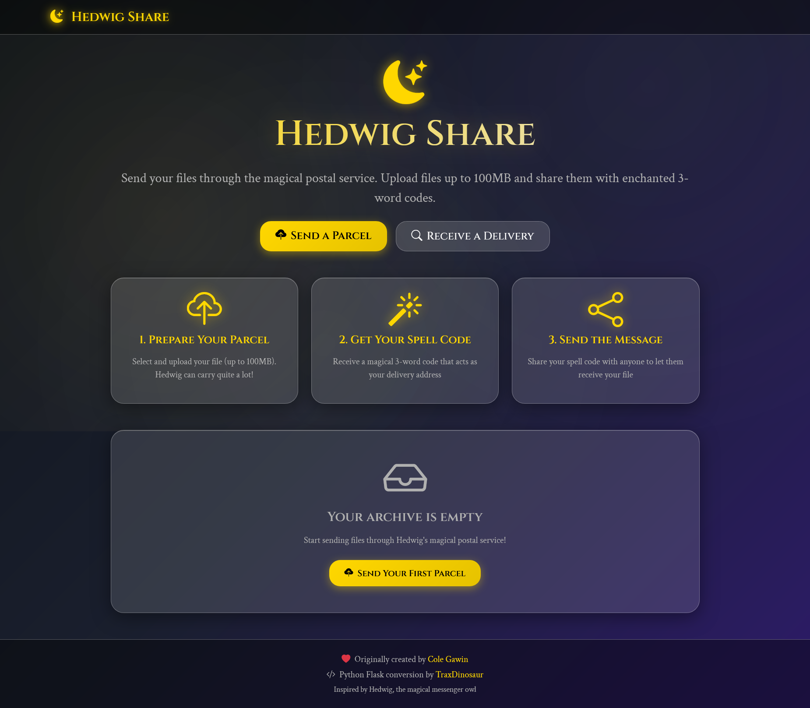

# 🌙 Hedwig Share

**A magical file sharing service powered by Python Flask.**  
Send your files through the magical postal service — upload files up to **100MB** and share them with enchanted **3-word codes**.



🔗 **Live Demo**: [hedwigshare.onrender.com](https://hedwigshare.onrender.com)  
🐙 **GitHub Repo**: [github.com/TraxDinosaur/HedwigShare](https://github.com/TraxDinosaur/HedwigShare)

---

## ✨ Features

- Upload files up to **100MB**
- Get a unique **3-word spell code** (powered by [`words-aas`](https://github.com/chroline/words-aas))
- Share and download files easily using spell codes
- Files are automatically purged after a period of time *(WIP)*

---

## 🦉 How It Works

1. **Prepare Your Parcel** – Upload your file (max 100MB)
2. **Get Your Spell Code** – A 3-word code will be generated
3. **Send the Message** – Share the code with others so they can retrieve the file

---

## 🧑‍💻 Development

### 🔧 Requirements

- Python 3.9+
- Flask
- Firebase Admin SDK

### 🚀 Run Locally

```bash
git clone https://github.com/TraxDinosaur/HedwigShare.git
cd HedwigShare
pip install -r requirements.txt
python app.py
````

### 🔥 Firebase Setup

1. Set up a Firebase project
2. Enable:

   * Anonymous Authentication
   * Firestore Database
   * Storage
3. Add your service account credentials JSON file
4. Set environment variable or load it in `firebase_admin.initialize_app`

---

## 📦 File Upload Limitations

* Maximum upload size: **100MB**
* Files expire after **21 days** *(WIP feature)*

---

## ❤️ Credits

* Originally created by [Cole Gawin](https://github.com/chroline) as [Lightning Share](https://github.com/chroline/lightning-share)
* Python Flask conversion by [TraxDinosaur](https://github.com/TraxDinosaur)
* UI Inspired by Hedwig, the magical messenger owl 🦉

---

## 🌟 Support

If you like **Hedwig Share**, consider:

* ⭐ Starring the repo!
* 🐦 Join my Telegram Channel [@AccioTraxDinosaur](https://telegram.me/AccioTraxDinosaur/)


---

© [TraxDinosaur](https://github.com/TraxDinosaur) | MIT License
